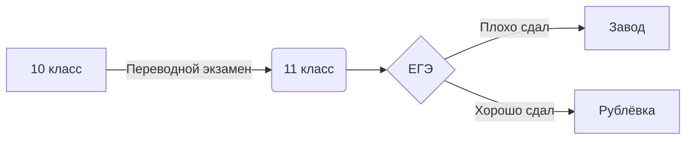

# scvaer
Рассказов Никита 021 группа

bdtest.py.txt Создание баз данных

python шпора.ipynb.txt Команды Пайтона

Снимок экрана.png пример работы нейросетей

SELECT COUNT(*) AS TABLE_COUNT - Показывает сколько таблиц

SELECT TABLE_NAME FROM INFORMATION_SCHEMA.TABLES WHERE TABLE_TYPE='BASE TABLE' - Название всех таблиц

SELECT * FROM users; Показывает пользователей

SELECT * FROM grades; Показыает все оценки

SEKECT * FROM users,grades WHERE users.user_id=grades.user_id -Кто получил оценки

$$\cos^{2}+\sin^{2}=1$$

$$\\ln\grave{x}=\frac{1}{x}$$

$$\overline{E}_1^2=\sqrt\frac{Fa^{x-1}}{(x-1)\cdot x}+a_1{}^{\frac{1}{2}}{}\+b_2{}^{\frac{2}{3}}{}\$$

`

